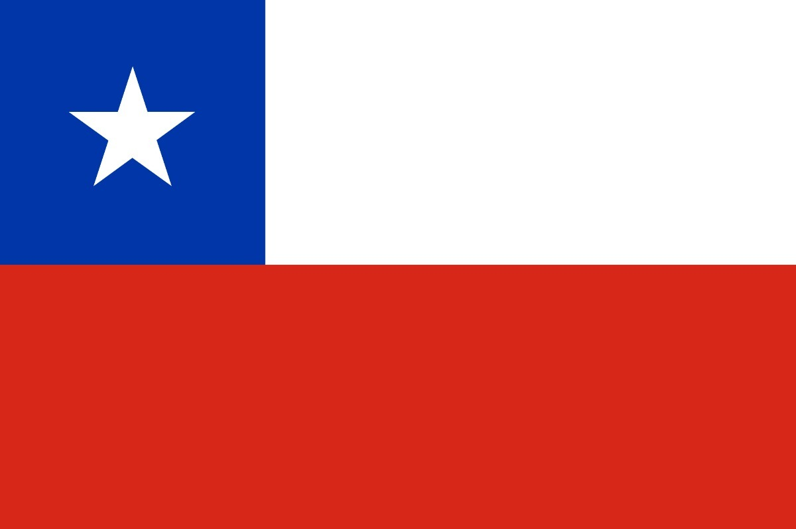

# Ecoleta - Semana Next Level Week 1 (NLW)
 
 --------------------------------------------------------------------------------------------------------------------------
### IDIOMA: Português

## Mais um projeto da RocketSeat

### Descrição de dowload e inicialização
#### Para poder rodar o projeto Ecoleta você deve apertar no botão Clone or dowload no meu projeto e baixar o .zip,
#### dentro do seu terminal do VS Code você faz a instalação das dependências do projeto com "npm install"
#### e para finalizar, ainda dentro do terminal do VS Code você roda o projeto com "npm start".
#### A aplicação se localiza em "localhost:3000/" no seu navegador.

### De que se trata a aplicação?
#### De ajudar a um usuario encontrar pontos de coleta de resíduos em sua cidade.

### Como isso funciona?
#### As empresas interesadas podem entrar na página e registrar os seus pontos de coleta, mas
#### ou mesmo um usuario que localizou um ponto de coleta pode ingresar ese ponto de coleta  
#### para assim informar a outros usuarios desse ponto e promover o uso da desses locais de coleta. 
#### A finalidade é que se um indivíduo precisa jogar algum resíduo que não deve jogar no 
#### lixo convercional, ele poderá procurar um local de coleta mais próximo da sua casa.

### Este projeto foi programado com
#### CSS, HTML, JavaScript
#### Nunjucks, SQLite3, Express
#### Node, nodemon
--------------------------------------------------------------------------------------------------------------------------
### IDIOMA: Español

## Otro proyecto de RocketSeat (Brasil)

### Descripción de descarga y inicialización
#### Para hacer funcionar el proyecto Ecoleta debes precionar el botón Clone or dowload en mi proyecto y bajar el .zip,
#### dentro del terminal de VS Code debes hacer la instación de las dependencias del proyecto con "npm install"
#### y para finalizar, todavía dentro del terminal de VS Code debes digitar "npm start" para hacer funcionar el proyecto
#### La página estará en la URL: localhost:3000/ en tu navegador.

### ¿De que se trata la aplicación?
#### De ayudar a un usuario encontrar los puntos de recolección de residuos en su ciudad.

### ¿Como eso funciona?
#### Las empresas interesadas pueden entrar en la página y registrar sus puntos de recolección, o
#### también un usuarios que localiza un punto de recoleción puede ingresarlo en la página
#### para así informar otros usuarios ese punto y promover el uso de esos locales especiales de recoleción.
#### La finalidad es que un indivíduo que necesite tirar algún residou que no de debe descartar en
#### la basura convencional, el podrá buscar un local de recolección mas cerca de su hogar.

### Este proyecto fue programado con
#### CSS, HTML, JavaScript
#### Nunjucks, SQLite3, Express
#### Node, nodemon

